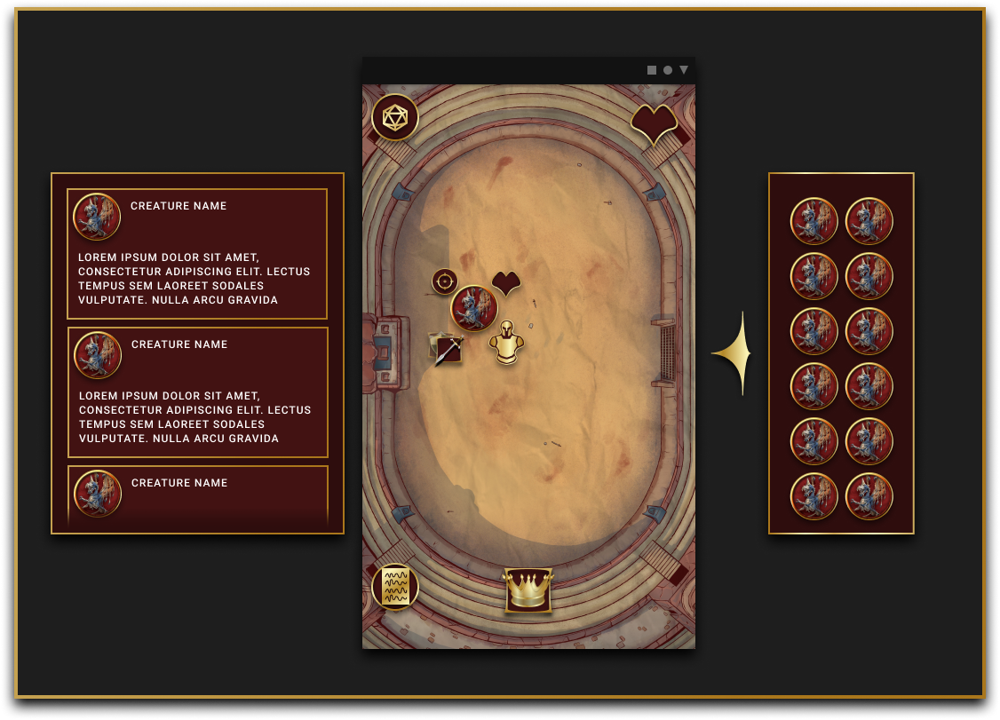
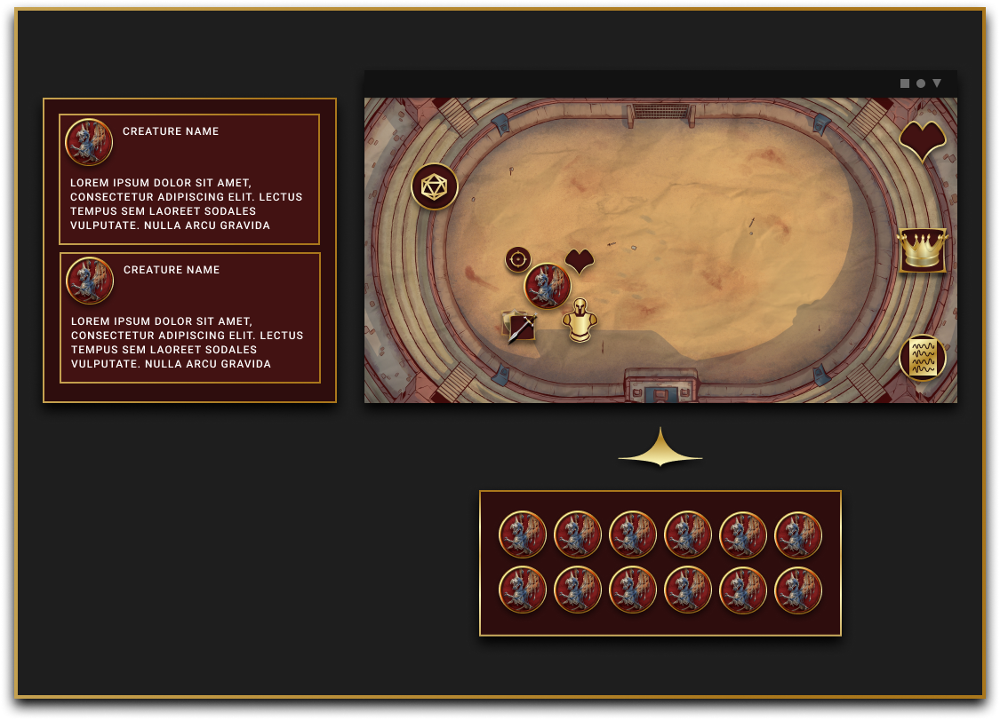
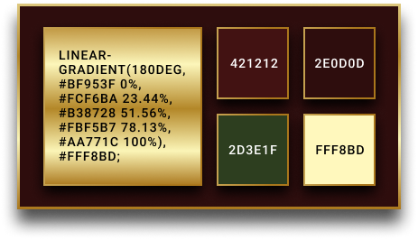
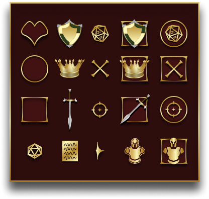
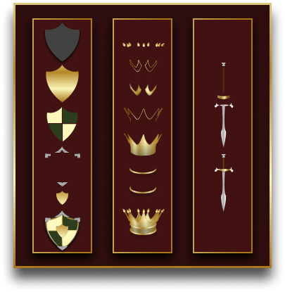

# DNGN Binder

[Live Website](https://dngnbinder.web.app/)

## Table of contents

- [Overview](#overview)
  - [The challenge](#the-challenge)
  - [Screenshot](#screenshot)
  - [Links](#links)
- [My process](#my-process)
  - [Built with](#built-with)
  - [What I learned](#what-i-learned)
  - [Useful resources](#useful-resources)
- [Author](#author)

## Overview

Desktop and mobile web app that uses the dungeons and dragons api to simulate a dnd battle. WORK IN PROGRESS

### The challenge

- Develop a game in React

### Designs

[Figma Project Here](https://www.figma.com/file/9J2AOIjR5QJqwEOOdP10ji/DNGN-Binder?node-id=1410%3A9607)

### Links

- Solution URL: [https://github.com/SyntheticDesigner/dnd-api-game](https://github.com/SyntheticDesigner/dnd-api-game)
- Live Site URL: [https://dngnbinder.web.app/](https://dngnbinder.web.app/)

## My process

The Project started as just pulling data from the dnd api database

### Built with

- Semantic HTML5 markup
- Custom CSS components
- CSS Flex Box
- CSS Grid
- [React](https://reactjs.org/)
- [Styled Components](https://styled-components.com/)
- [Redux](https://redux.js.org/)
- [Redux Toolkit](https://redux-toolkit.js.org/)
- [D&D 5e Api](http://www.dnd5eapi.co/)

### What I learned

### Useful resources

- [React](https://reactjs.org/)
- [Styled Components](https://styled-components.com/)
- [Redux](https://redux.js.org/)
- [Redux Toolkit](https://redux-toolkit.js.org/)

## Author

- Andrew Schroepfer - Developer
  - [Website](https://syntheticdesigner.github.io/)
  - [Linkedin](https://www.linkedin.com/in/andrew-schroepfer/)